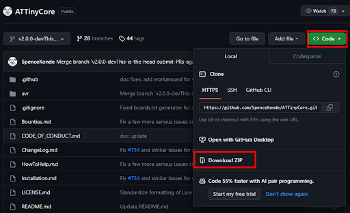
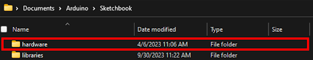
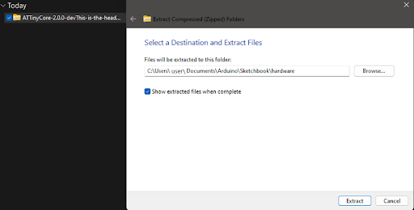
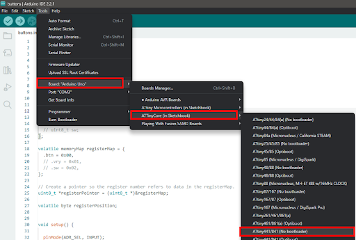
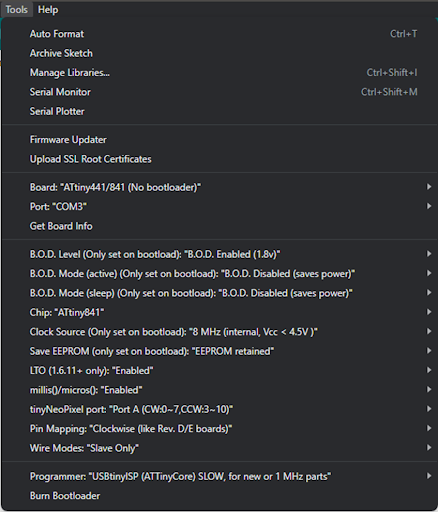
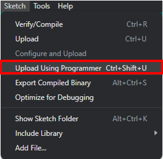
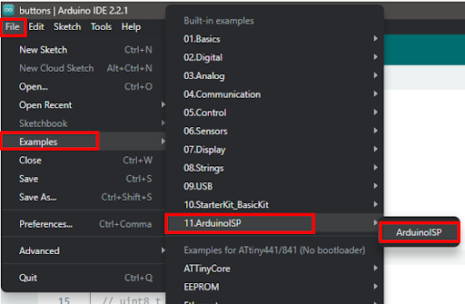
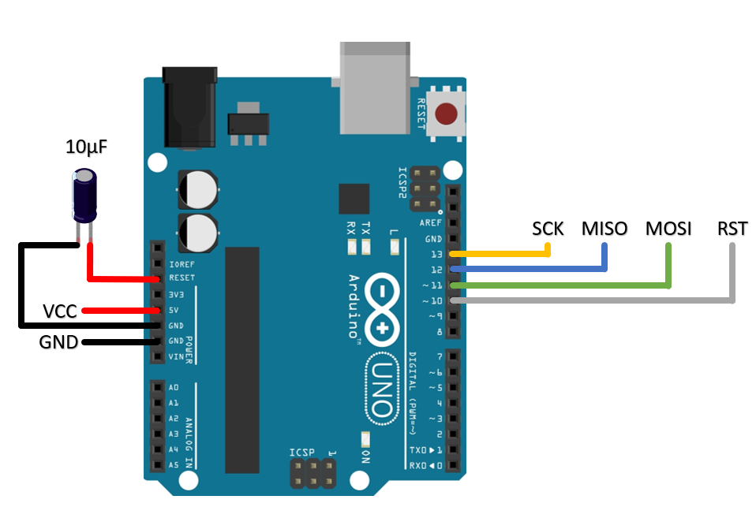
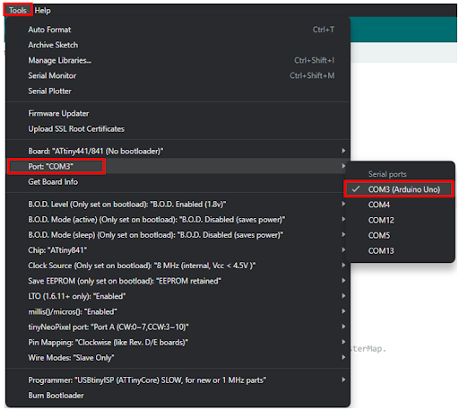

# Programming Instructions

## Introduction
If you find yourself needing to make changes to the firmware on an interface board, follow these steps to flash your own firmware onto the embedded microcontroller.

All that is required to reporgram a Playing with Fusion I2C board is an AVR programmer. These are available in many forms. This document will cover 2 methods, using a dedicated AVR programmer from Sparkfun and using an Arduino Uno.

## Setup

First, you will need to install the ATtiny Core boards package for the arduino IDE. 

---

**Step 1**

Follow the link [here](https://github.com/SpenceKonde/ATTinyCore/tree/v2.0.0-devThis-is-the-head-submit-PRs-against-this) and download the zip file.

---

**Step 2**

Locate the sketchbook directory for your Arduino IDE. You can find this by going to File->Preferences within the Arduino IDE. The sketchbook directory will be listed. Within this directory, locate the hardware folder. If this folder doesn't exist, create it.

---

**Step 3**

Unzip the AtTiny Core folder into the hardware folder in your Arduino Sketchbook folder.

---

**Step 4**

Restart the Arduino IDE.
Within the Arduino IDE, select Tools->Board->ATTinyCore (in sketchbook). This will reveal a list of new ATTiny boards you can now select when programming through the Arduino IDE.

---

## Sparkfun Tiny Programmer

**Step 1**

Follow Sparkfun's tutorial [here](https://learn.sparkfun.com/tutorials/tiny-avr-programmer-hookup-guide/?_gl=1*1qrfgwy*_ga*MTM1OTUxOTg0NS4xNjkyODAyNTc1*_ga_T369JS7J9N*MTY5NjE3ODA3My4xMi4xLjE2OTYxNzgwODkuNDQuMC4w&_ga=2.47319523.57215827.1696023143-1359519845.1692802575) to install the correct drivers. Open the link and scroll down to the "Driver Installation" section.

---

**Step 2**

Within the Arduino IDE, go to tools->Board->ATTinyCore (in Sketchbook) and select ATtiny441/841 (no bootloader).

---

**Step 3**

Go to tools->Chip and make sure the ATtiny841 is selected.
Go to tools->Programmer and select USBtinyISP (ATTinyCore) SLOW.
Make sure all other settings match as above.

---

**Step 4**

Plug the tiny programmer into a USB port on your device. Connect the pins of the programmer to the respective pads of the I2C interface board you wish to program. This can be done using a pogo pin programming block, or by some standard stacking female pin headders.

Whichever method you choose, it is vital that the pins do not become disconnected during the programming process, otherwise the flash process will fail.

---

**Step 5**

In the Arduino IDE, go to sketch->Upload using programmer.
Keep the programmer pins to the pads of the PCB until the flashing process is complete.

---

## Arduino as ISP

**Step 1**

In the Arduino IDE, go to file->examples->ArduinoISP and select the example sketch. This code will open up in a new window. Upload this to the Arduino Uno you wish to use as the programmer.

---

**Step 2**

Connect the Arduino ISP programmer pins to the pads of the PCB using your prefered method. Connect a 10uF electrolytic capacator between the GND and RST pins of the Arduino Uno. The schematic should look like the diagram above.

---

**Step 3**

Within the Arduino IDE, go to tools->board->ATTinyCore (in sketchbook) and select ATtiny441/841 (no bootloader).

---

**Step 4**

Go to tools and make sure all of the board settings match as above.

---

**Step 5**

Select the part that the Arduino Uno (programmer) is on within the tools menu.

---

**Step 6**

Ensure the arduino is completely connected to the desired PCB's programming pads.
Go to sketch->Upload using programmer

## Additional Links

https://docs.arduino.cc/built-in-examples/arduino-isp/ArduinoISP

